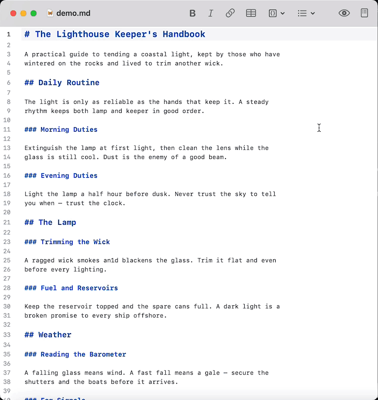

# MarkEdit Bidirectional Preview Sync

Keeps [MarkEdit](https://github.com/MarkEdit-app/MarkEdit)’s editor and preview panes synchronized as you switch, scroll, and select text between them. Also includes an experimental feature that mirrors text selection from the preview to the editor.

[MarkEdit-preview](https://github.com/MarkEdit-app/MarkEdit-preview) can keep the preview aligned as you edit but it’s one-way only; when you scroll the preview it doesn't move the editor. This extension keeps both views aligned, so you can move quickly between reading the rendered document and editing the source.

This is particularly useful when using preview mode to proofread. When you spot a mistake, switching back to the editor takes you to the text you were just reading instead of making you hunt for it again.

HTML can’t be mapped to Markdown perfectly, so there may be instances where switching from preview to editor doesn’t scroll to the exact correct location. Luckily this functionality doesn't need to be perfect to remove friction from your workflow; it just needs to be good. This extension easily clears that bar. It also works nicely with my [Outline Sidebar](https://github.com/Nigelw/MarkEdit-outline-sidebar) extension.



**[Download the latest release](https://github.com/Nigelw/MarkEdit-bidirectional-preview-sync/releases/latest/download/markedit-bidirectional-preview-sync.js)** then see [Install](#install) below.

## Install

1. Download `markedit-bidirectional-preview-sync.js` from the [latest GitHub release](https://github.com/Nigelw/MarkEdit-bidirectional-preview-sync/releases/latest).
2. Move it into MarkEdit's scripts folder: `~/Library/Containers/app.cyan.markedit/Data/Documents/scripts/`
3. Quit and reopen MarkEdit.
4. Follow the prompt to disable MarkEdit-preview's one-way scroll sync.
5. Quit and reopen MarkEdit again.

**Disabling One-Way Sync**

MarkEdit-preview's one-way scroll sync must be disabled for this extension to run. Using both systems at once would cause conflicts, so this extension disables itself if one-way scroll sync is enabled.

When this extension is installed it automatically offers to disable MarkEdit-preview’s scroll sync so you don’t need to update `settings.json` manually.

If you prefer to make the change manually, set MarkEdit-preview's `syncScroll` option to `false`:

```json
{
  "extension.markeditPreview": {
    "syncScroll": false
  }
}
```

## Settings

Use *Extensions → Bidirectional Preview Sync → Sync After Scrolling Stops* or *Sync While Scrolling* to change `syncTiming` without manually editing the settings file or relaunching MarkEdit.

Use *Extensions → Bidirectional Preview Sync → Experimental Features → Mirror Preview Selection* to toggle whether selecting text in the preview also selects the matching Markdown source in the editor. This feature is unsupported and has quirks, see note below.

### Manual Settings

Settings can be edited manually under `extension.bidirectionalPreviewSync`:

```json
{
    "extension.bidirectionalPreviewSync": {
      "syncTiming": "afterScroll",
      "mirrorPreviewSelection": false,
      "referenceRatio": 0,
      "update": "notify"
  }
}
```

- `syncTiming`: controls when the paired view updates.
  - `"afterScroll”` (default) and waits for scrolling to settle.
  - `"whileScrolling"` updates the paired view continuously as you scroll.
- `mirrorPreviewSelection`: mirrors preview text selections into the editor when set to `true`. Off (`false`) by default.
  - Mapping is best-effort. Complex format types may select a nearby source span rather than the exact characters.
- `referenceRatio`: chooses which part of the visible viewport the extension tries to keep aligned between the editor and preview. Use a number from `0` to `1`:
  - `0` (default) keeps the top visible editor line matched to the top of the preview, `0.5` aligns from the middle of the viewport, and `1` aligns from the bottom.
  - Numbers outside `0`-`1` are rounded to the nearest allowed value; non-numeric values use the default.
- `update`: controls update checking.
  - `"notify”` (default) asks before installing.
  - `"automatic"` downloads newer releases silently and prompts for a relaunch.
  - `"never"` disables automatic checks.

Settings edited manually in `settings.json` are read at launch, so quit and reopen MarkEdit after manual edits for changes to take effect.

### A Warning About "Mirror Preview Selection"

This is a step beyond scroll sync: while proofreading in preview mode, selecting the text you want to fix also selects it in the editor. This lets you jump straight to it and start typing the correction instead of scanning the source for the right spot.

It's deliberately not an attempt at WYSIWYG Markdown editing. Markdown should be written and edited with its syntax visible, not hidden behind a rendered view. This feature only shortens the trip from "I see the mistake" to "I'm positioned to fix it”.

It lives under *Experimental Features* and defaults to off because mapping a rendered selection back to source ranges has edge cases that fundamentally can't be solved well. A footnote reference, for example, can be written inline in Markdown but positioned at the end of the rendered preview, so there’s no “correct” way to handle mirroring a selection containing a footnote with surrounding text. That said, I’ve tried to handle all common formatting reliably. Complex elements like Mermaid diagrams and math notation aren’t supported.

The implementation is intentionally simple in that it relies on regex rather than a syntax parser. My goal was to get to “good enough” while being maintainable and dependency-free. (I don’t want to have to keep up with other projects’ updates, and I don’t have the desire to implement my own parser. There are also hard limits on how well this feature can work as an add-on to MarkEdit-preview, so there’s not much to be gained by using a proper parser.)

Tl;dr: this feature is helpful but far from perfect. It may break in the future depending how MarkEdit-preview evolves. Turn it on if that trade-off is worth it for your workflow.

## Staying Up To Date

The extension checks [GitHub releases](https://github.com/Nigelw/MarkEdit-bidirectional-preview-sync/releases) for a newer version shortly after MarkEdit launches, at most once a week. You can also run *Extensions → Bidirectional Preview Sync → Check for Updates...* at any time. When a newer release is found, the extension downloads the release asset named `markedit-bidirectional-preview-sync.js` and replaces its own installed script file; the new version takes effect after restarting MarkEdit.

## Extension Integration

Other extensions can signal intentional navigation scrolls through `window.__markeditBidirectionalPreviewSync__`. Call this immediately before starting programmatic navigation so this extension treats that view as the scroll source and avoids competing corrections while the scroll is in progress:

```js
const sync = window.__markeditBidirectionalPreviewSync__;
sync?.beginEditorScroll?.({ animated: true });
view.dispatch({ effects: EditorView.scrollIntoView(pos, { y: 'start' }) });
```

Available methods:

- `beginPreviewScroll({ animated })`: the preview is about to scroll because of external navigation.
- `beginEditorScroll({ animated })`: the editor is about to scroll because of external navigation, such as an outline/sidebar click.
- `beginScroll(source, { animated })`: generic form where `source` is `"preview"` or `"editor"`.

Set `animated` to the scroll behavior the paired view should use. This lets a navigation extension request smooth preview movement even when this extension is using `"whileScrolling"` sync timing. (`"whileScrolling”` mode normally scrolls the preview instantly to keep it tightly in sync with the user’s scrolling in the editor view). Smooth source locks use a longer timeout; instant locks release quickly.

## Development

```sh
npm install
npm run typecheck
npm run build
```

The build uses `markedit-vite` to output a single CommonJS user script and copy it into MarkEdit's scripts folder. Developer notes and the release process live in [AGENTS.md](AGENTS.md).
