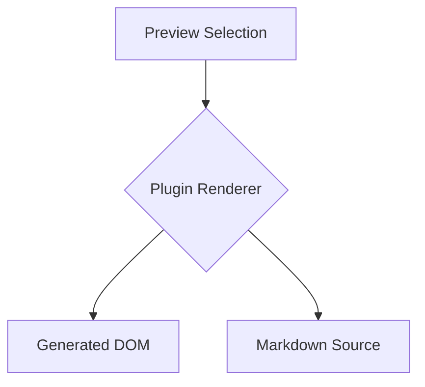

# Preview Selection Mirroring Test

Use this document to compare how preview text selections map back to Markdown source selections. Each section names the content type it is intended to exercise.

## Baseline Prose

This paragraph is plain Markdown text. Selecting any phrase here should be the easiest case for preview-to-editor mirroring.

## Styled Text

This paragraph contains **bold text**, _italic text_, ***bold italic text***, `inline code`, ~~strikethrough text~~, and a [link label](https://example.com/selection-test).

Expected preference: selecting rendered styled text should select the content text in Markdown, not the surrounding formatting markers or link destination.

## Headings And Generated Anchors

### Repeated Heading

Some preview renderers generate anchors, heading links, or duplicate slug IDs around headings. Select the visible heading text above, then try selecting this sentence.

### Repeated Heading

This duplicate heading checks whether generated anchor handling or duplicate IDs affect selection mapping.

## Table

| Feature | Rendered text | Source shape |
| --- | --- | --- |
| Emphasis | **bold cell text** | Pipes and alignment markers are not visible |
| Code | `cell_code()` | Inline code markers are hidden |
| Link | [cell link](https://example.com/table-link) | URL is hidden in preview |

Try selecting text inside a cell, across cell boundaries, and across multiple rows.

## Task List

- [ ] Unchecked task item with **bold task text**
- [x] Checked task item with `inline_task_code`
- [ ] Task item with a [task link](https://example.com/task-link)

Try selecting only the task text, then selecting from the checkbox region into the text.

## Image


The image has alt text and a URL in Markdown, but the preview mostly exposes an image element. Try selecting near the image, the caption-like paragraph below, and any alt text if your preview exposes it.

## Raw HTML Block

<div class="selection-test-card">
  <h3>Raw HTML Heading</h3>
  <p>This paragraph is written as raw HTML with <strong>strong HTML text</strong> and <code>htmlCode()</code>.</p>
  <a href="https://example.com/raw-html">Raw HTML link text</a>
</div>

Try selecting text inside the raw HTML block and across the boundary into this paragraph.

## HTML Entities

This line contains named entities in source: &amp; &lt; &gt; &quot; &apos; &copy; &mdash; &nbsp;.

This line contains literal equivalents for comparison: & < > " ' (c) - space.

Try selecting individual symbols and a run that crosses entity-rendered characters.

## Footnotes

This sentence has a footnote reference.[^selection-footnote] Try selecting the reference marker, the sentence text, and the rendered footnote text in the preview.

[^selection-footnote]: This is the footnote body with **bold footnote text**, `footnote_code`, and a [footnote link](https://example.com/footnote-link).

## Deeply Nested Markup

> A blockquote containing a list:
>
> 1. First nested item with **bold _italic inside bold_ text**.
> 2. Second nested item with [`linked inline code`](https://example.com/nested-code-link).
>    - Nested bullet with ~~struck text and `code` together~~.

Try selecting within one nested span, across nested formatting boundaries, and across list item boundaries.

## Plugin-Rendered Or Extension Content



```math
E = mc^2
```

```abc
X:1
T:Selection Test Tune
M:4/4
K:C
CDEF GABc|
```

These fenced blocks are examples of content that may be transformed by preview plugins into DOM that no longer resembles the source text. If your preview does not have these plugins, they may render as ordinary code blocks instead.

## Cross-Block Selection

Start selecting in this paragraph.

Then drag into this paragraph, across the blank line and block boundary.

> Then continue into this blockquote if you want to test a more complex cross-block selection.
